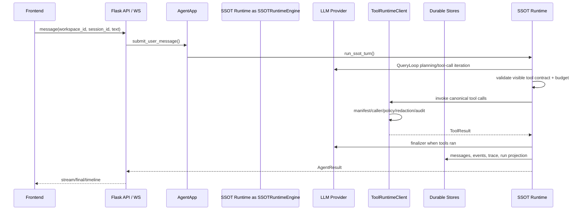

# Network Agent Design

本设计文档只描述当前实现，不保留旧架构、旧工具名或兼容路径。

## 设计原则

1. **单主链**：所有用户请求进入同一条运行时链路，避免旁路执行。
2. **硬边界**：工具必须经过 manifest、caller、risk、approval、redaction、audit。
3. **显式 workspace**：所有跨数据边界操作必须带已验证 `workspace_id`。
4. **能力只描述，工具才执行**：业务能力目录用于提示和 UI，不参与 handler 注册。
5. **最新口径优先**：不为旧 API、旧工具名、旧文档叙述保留分支。
6. **GraphStore SSOT**：运行时与投影状态先写入 append-only GraphStore event log；run/message/artifact/memory 文件只是读模型投影。
7. **Function Calling**：工具 schema 通过 LLM 的 `tools` 参数传递，不文本 dump 到 prompt。

## 主链路



## Durable Runtime

运行时状态由四类数据构成：

- `TaskState`：一次用户任务的权威状态。
- `RuntimeStep`：context、model、tool、final 等阶段步骤。
- `RuntimeEvent`：前端时间线和审计事件来源。
- `RuntimeCheckpoint`：中断、审批、失败恢复的快照。

SSOT Runtime 主链将执行结果投影为 `AgentResult`、message、run 和 trace；长任务类能力仍使用 durable task/checkpoint API 管理自己的可取消状态。

## Tool Runtime

`ToolRuntimeClient.invoke()` 是唯一合法入口。执行顺序：

```text
canonical tool id
  -> CapabilityManifest
  -> requested_by caller gate
  -> ToolPolicy
  -> approval/interrupt when needed
  -> ToolExecutor
  -> redaction
  -> trace/audit
  -> ToolResult
```

当前只有 29 个 canonical tool。`handler_id` 是内部实现细节，不暴露给 LLM、前端或公共 API。SSOT Runtime 节点不会直接调用 handler，只能通过 `ToolRuntimeClient.invoke()` 进入工具边界。

## Capability Catalog

`agent/capabilities/catalog.py` 是业务能力目录，当前 12 个能力，全部 enabled。目录只提供：

- 能力说明
- 推荐 canonical tool
- prompt hint
- safety note
- 前端展示数据

它不注册工具、不控制权限、不分发 handler。

## Approval

审批只用于高危或破坏性操作。普通 read/list/query 不应因为工具类别本身被阻断。审批生命周期是 durable interrupt：

```text
tool policy requires approval
  -> pending approval + checkpoint
  -> TaskState waiting_approval
  -> user approve/reject/edit_args
  -> resume or fail
```

## Memory Governance

记忆写入必须经过 `MemoryWriteGate`：

1. 校验 workspace。
2. 先检测密钥模式，再脱敏。
3. 根据来源、置信度、scope、TTL、冲突判断状态。
4. 只有 `active`、未过期、同 workspace 的记录可检索。

LLM 失败时不能泄露异常文本，降级原因必须结构化。

## Prompt 与上下文

Prompt 由模块化 block 组装：角色、行为规则、环境、能力、工具策略、安全策略、输出要求。上下文管道负责 history、scene、retrieval、safe context、loaded capability 和 metadata write。

工具 schema 通过模型 tools 字段提供；system prompt 只提供策略和工具选择原则，不内联长工具清单。

## Frontend

前端以任务工作台为中心：

- 对话视图展示用户消息、LLM 回复、工具卡、审批气泡。
- 时间线视图读取 `AgentResult.events` 和 runtime state。
- 会话、最近运行、workspace 全部显式绑定。
- 前端不得制造默认 workspace，也不得自行补旧 API 格式。
