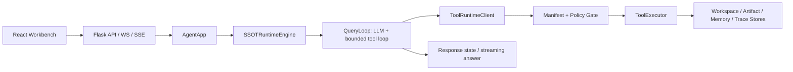

# Network Agent

Network Agent 是一个面向网络运维场景的本地 AI Agent 工作台。当前架构只保留一套运行时、一套工具边界和一套业务能力目录：前端通过 Flask API 与 WebSocket/SSE 驱动对话，后端由 `AgentApp -> SSOTRuntimeEngine -> ToolRuntimeClient` 统一执行，工具统一收敛为 29 个 canonical tool。

> **运行环境**：Python 3.12+ / Node.js 18+ / macOS 或 Linux。

## 快速启动

```bash
bash start.sh
```

默认地址：

- Frontend: `http://localhost:5173`
- Backend: `http://127.0.0.1:8010`（默认绑定 localhost，生产部署时通过 `--host 0.0.0.0` 显式指定）

停止服务：

```bash
bash stop.sh
```

## 当前架构



核心链路只有一条：`AgentApp -> SSOTRuntimeEngine -> QueryLoop -> ToolRuntimeClient -> ToolExecutor`。SSOT Runtime 负责工具可见性、QueryLoop 迭代、任务跟踪、重试元数据和最终答复；任何工具调用都必须携带 `requested_by`，必须命中 `CapabilityManifest`，并且必须通过 caller gate、风险策略、脱敏和审计。

## 核心模块

| 模块 | 当前职责 |
| --- | --- |
| `backend/` | Flask 入口、REST API、WebSocket、SSE、认证 |
| `frontend/` | React/Vite 工作台、会话、时间线、设置、资产、诊断 |
| `agent/app/` | AgentApp 门面、SessionManager、AgentThread |
| `agent/runtime/` | SSOT Runtime 适配、AgentResult 投影与持久化 |
| `agent/modules/` | inspection（巡检）、browser（浏览器操控）、cmdb（资产）、knowledge（知识库）、remote（远程终端） |
| `core/tools/` | 29 个 canonical tool、manifest、policy、executor、redaction |
| `agent/capabilities/` | 12 个业务能力目录，只描述能力，不注册工具 |
| `workspace/` | session/run/message/memory/workspace 数据边界 |
| `artifacts/` | 制品生命周期与内容存储 |
| `jobs/` | 作业系统（store/schemas/manager/worker/redaction） |
| `observability/` | trace/event 记录 |
| `harness/` | 后端架构和契约测试 |

## 关键设计决策

### 巡检流程（v3.11+）
- 巡检由**前端驱动**：CMDB 点击按钮 → 异步创建后台任务 → 轮询 task_id → 完成后 auto-send 分析 prompt
- LLM 只做分析：通过 `inspection.manage action=report` 自行拉取原始输出，不再由前端嵌入大段内容
- `inspection.manage action=get` 返回 slim 数据（不含 output_snippet），避免轮询撑爆上下文

### LLM 配置
- 默认 `max_tokens: 4096`（v3.11 从 1200 提升，避免巡检分析输出截断）
- `config/providers/` 保存每 provider 配置（不入 git），`config/llm.local.yaml` 管理本地覆盖
- `NETWORK_AGENT_AUTH_ENABLED=true` 时 WebSocket 也需携带 `auth_token`

### 安全
- 后端默认绑定 `127.0.0.1`（v3.11，从 `0.0.0.0` 改为 localhost-only）
- SSH/Telnet 密码通过 HMAC + XOR stream cipher with HMAC 加密存储，不会明文落盘
- Web Content Fetch 有 DNS rebinding 二次校验 + 5MB 响应上限
- 所有 SSH/Telnet 巡检命令强制只读校验

### CMDB
- JSONL append-only + RLock 并发控制，软删除（tombstone 标记）
- 密码损坏检测（`password_corrupted` 标记）在列表和单资产查询中生效

## 23 个 Network Agent Tools

`agent.manage`, `browser.manage`, `config.manage`, `data.manage`, `device.manage`, `exec.run`, `inspection.manage`, `knowledge.manage`, `memory.manage`, `pcap.manage`, `report.manage`, `skill.manage`, `spawn_config_translate_agent`, `spawn_network_diag_agent`, `spawn_security_agent`, `system.manage`, `text.analyze`, `web.manage`, `workspace.artifact`, `workspace.document.pdf.extract_text`, `workspace.file`, `workspace.filestore`, `workspace.metadata.get`

工具名、manifest 和 registry 必须三方一致。不要添加别名，不要恢复旧工具名，不要让 handler 绕过 `ToolRuntimeClient`。

## Workspace 与数据

- `workspace_id` 是所有运行时数据的隔离边界。
- API 入参缺失或非法 `workspace_id` 必须返回 400。
- `workspaces/default/` 是本地默认工作区数据。
- `workspaces/_runtime/` 保存 durable task、checkpoint、trajectory 等运行时状态。
- `config/providers/` 与 `config/llm.local.yaml` 保存本机 LLM 配置，不入库。

## 验证命令

```bash
python3 -m pytest harness/test_business_capability_catalog.py harness/test_ssot_runtime_contract_canonical_sync.py -q
python3 -m pytest harness/test_framework_chain_closure.py harness/test_ssot_runtime_main_entry_contract.py -q
npm --prefix frontend run typecheck
```

只在需要全量回归时运行完整 harness；日常修复以契约测试和受影响路径测试为准。
